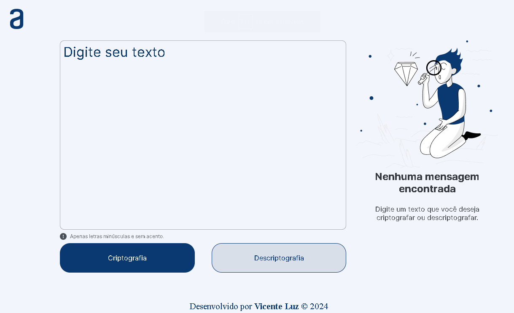
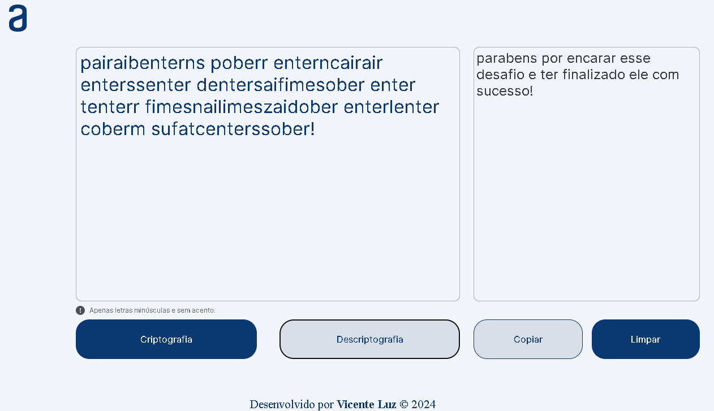

# Text decoder

## Summary

- [About](#about)
- [Technologies](#technologies)
- [Access the System](#access-the-system)
- [Screenshots](#screenshots)
- [Contribution](#contribution)
- [Contact](#contact)

## About

This project was developed as part of the Oracle One Class 6 challenge in partnership with Alura. It provides a simple yet effective text encryption and decryption tool. Users can easily convert their messages into secret codes using the specified encryption rules, allowing for secure communication among those who know the secret key.

- **Encryption Rules:**
  - The letter "e" is converted to "enter"
  - The letter "i" is converted to "imes"
  - The letter "a" is converted to "ai"
  - The letter "o" is converted to "ober"
  - The letter "u" is converted to "ufat"

## Technologies

- [JavaScript](https://www.javascript.com/)
- [HTML5](https://www.w3schools.com/html/default.asp)
- [CSS3](https://www.w3schools.com/css/default.asp)

## Access the System

Click [here](https://vicentejluz.github.io/text-decoder/) to access the system.

## Screenshots

> _Home page of the system._

 

> _Home Page of the system with filled fields._

## Contribution

Contributions are welcome! If you encounter any issues or have suggestions for improvements, please open an issue or submit a pull request to the repository.

## Contact

    
      
    
   

